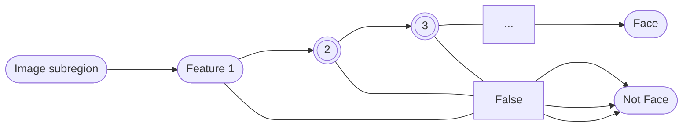

# Nhận diện khuôn mặt sử dụng CNN
<!-- English | [Tiếng Việt](README-vi.md) -->

## Mục tiêu
- Tìm hiểu nguyên lý của việc **phát hiện** và **nhận diện** khuôn mặt trong ảnh tĩnh
- Xây dựng ứng dụng đánh dấu và gán nhãn các khuôn mặt (đã biết) xuất hiện trong ảnh tĩnh

## Triển khai

Các kỹ thuật sử dụng:
1. Phát hiện gương mặt (Faces Detection): sử dụng Haar Cascades
2. Nhận diện khuôn mặt (Face Recognition): sử dụng mạng tích chập (Convolutional Neural Network)

## Nội dung
### Phát hiện gương mặt bẳng Haar Cascades
1. Tổng quát quá trình hoạt động

2. Đặc trưng Haar
3. Integral Image
4. Độ phức tạp
5. Ưu & nhược điểm

### Nhận diện gương mặt sử dụng CNN